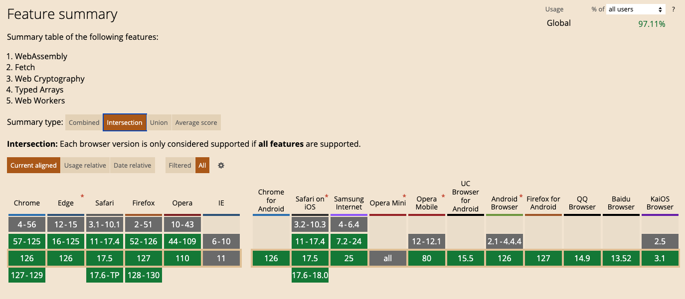

The SDK uses several modern browser technologies, including:

- [WebAssembly](https://webassembly.org/)
- [Web Workers](https://developer.mozilla.org/en-US/docs/Web/API/Web_Workers_API)
- [Web Crypto API](https://developer.mozilla.org/en-US/docs/Web/API/Web_Crypto_API)
- [Typed arrays](https://developer.mozilla.org/en-US/docs/Web/JavaScript/Typed_arrays)
- [Fetch API](https://developer.mozilla.org/en-US/docs/Web/API/Fetch_API)

Because of these requirements, **the SDK is not supported on any version of Internet Explorer and on a few less-used mobile browsers**. The chart below from [caniuse.com](https://caniuse.com/wasm,webworkers,cryptography,typedarrays,fetch) summarizes the browsers and versions that support the SDK.

:::info
This chart is accurate as of August, 2022. For the most up-to-date browser support information, see [caniuse.com](https://caniuse.com/wasm,webworkers,cryptography,typedarrays,fetch).
:::
