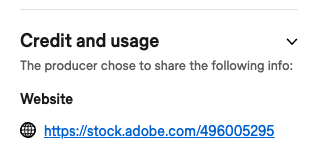
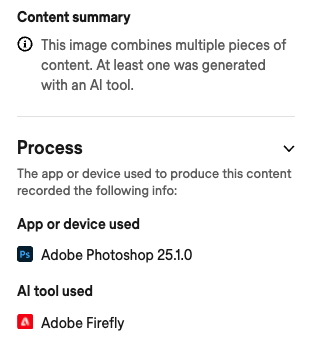
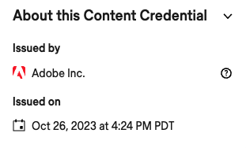
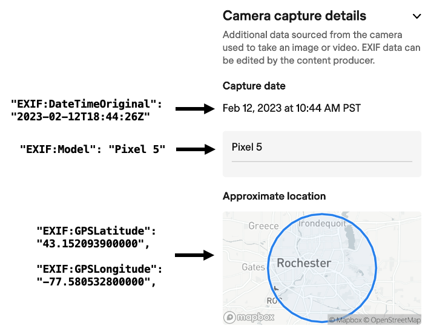

The C2PA **[Verify tool](https://contentcredentials.org/verify)** is useful both for consumers and for CAI application developers.

## How to use Verify

import verify_site from '../static/img/verify.png';


Using Verify, you can inspect a digital asset file in two ways:

- Upload a file from your local computer.
- Enter a URL to a publicly-visible asset.

Supported asset file types include:

- **Image**: AVIF, DNG, HEIC, HEIF, JPEG, PNG, SVG, TIFF, and WebP.
- **Video and audio**: M4A, MP3, MP4, and WAV.

<br clear="all" />

:::tip
Verify shows the complete current list of supported file types (when no asset is displayed on the page).
:::

### Uploading an asset

Click **Select a file from your device** then use the native picker or drag and drop a file to upload it and display information from the associated Content Credentials (if any) such as the author, the tools used to create the asset, and so on.

### Entering an asset URL

You can also create a link to display Content Credentials information for an asset at a publicly-visible URL, by using a URL like this:

```
https://contentcredentials.org/verify?source=<ASSET_URL>
```

where `<ASSET_URL>` is the URL of the asset.

For example: https://contentcredentials.org/verify?source=https://crandmck.github.io/public-testfiles/image/jpeg/adobe-20220124-CICA.jpg.

:::note
To use Verify on an asset URL, the hosting server must allow cross-origin resource sharing (CORS) in the `Access-Control-Allow-Origin` HTTP response header.
:::

## Information displayed

Once you've uploaded an asset or entered an asset URL, Verify displays information from the asset's Content Credentials, in the three vertical sections:

- The left section shows the asset file name and a thumbnail. Cick **Search for possible matches** to search the Adobe Content Credentials Cloud for similar content.
- The center section shows all the asset's ingredients in a tree-like layout. Click on an ingredient to display more information about it in the right section. Click **Compare** in the lower right of the center section to compare the ingredients either side-by-side or using a slider.
- The right section shows information from the asset's manifest store, as described below.

### Credit and usage



The **Credit and usage** section displays information derived from the [CreativeWork assertion](manifest/assertions-actions#creative-work-assertion). If there is an associated `name` property , then it says **Produced by**; if there is an associated `url` property, then it says **Website\* along with a link to the site. If there is an associated `license` property, then it says **License** along with a link to the license. If there is an associated `usage` property, then it says **Usage\*\* along with the usage information.

### Process

The **Process** section displays information about the process used to create the asset.

import verify_process from '../static/img/verify-process.png';


```json
"actions": [
  {
    "action": "c2pa.opened",
    "instanceId": "xmp.iid:813ee422-9736-4cdc-9be6-4e35ed8e41cb",
    "parameters": {
      "ingredient": {
        "hash": "tTBD4/E0R0AjLUdJFpsVz3lE/KJUq22Vz0UGqzhEpVs=",
        "url": "self#jumbf=c2pa.assertions/c2pa.ingredient"
      }
    }
  },
  {
    "action": "c2pa.color_adjustments",
    "parameters": {
      "name": "brightnesscontrast"
    }
  },
  {
    "action": "c2pa.placed",
    "instanceId": "xmp.iid:8a00de7a-e694-43b2-a7e6-ed950421a21a",
    "parameters": {
      "ingredient": {
        "hash": "EMeeY5a+lvy1msl+9i5DOcOoeQowrqD7NyV0d8fwAX0=",
        "url": "self#jumbf=c2pa.assertions/c2pa.ingredient__1"
      }
    }
  },
  {
    "action": "c2pa.resized"
  }
]
```

### AI-generated content



### About this Content Credential



### details



## Searching for matching Content Credentials

Click **Search for possible matches** to search the Adobe Content Credentials Cloud for similar content.
